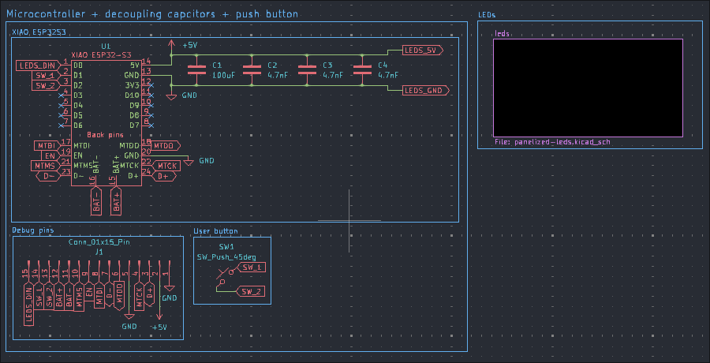

# led-glasses

Simple LED glasses controlled using a XIAO ESP32-S3 microcontroller.

## Credits

XIAO ESP32S3 footprint (XIAO-ESP32S3-SMD.kicad_mod): https://github.com/Seeed-Studio/OPL_Kicad_Library
XIAO ESP32S3 3D model: https://wiki.seeedstudio.com/xiao_esp32s3_getting_started/

Other 3D models sourced from EasyEDA.

## Todo

[-] Add battery switch circuit
[-] switch from 5V to 3V3, because 5V doesn't work with a battery
// breakout pins can be used to make a prototype using a battery
[x] breakout other pins

## BOM

- 62x | SK6812 LEDs: OPSCO Optoelectronics SK6812mini-012
  - https://www.lcsc.com/product-detail/RGB-LEDs-Built-in-IC_OPSCO-Optoelectronics-SK6812mini-012_C2886570.html?s_z=n_SK6812MINI-012
- 1x | 1uF capacitor: Samsung Electro-Mechanics CL31A107MQHNNNE
  - https://www.lcsc.com/product-detail/Multilayer-Ceramic-Capacitors-MLCC-SMD-SMT_Samsung-Electro-Mechanics-CL31A107MQHNNNE_C15008.html
- 3x | 4.7 nF capacitor: FH (Guangdong Fenghua Advanced Tech) 1206B472K102NT
  - https://www.lcsc.com/product-detail/Multilayer-Ceramic-Capacitors-MLCC-SMD-SMT_FH-Guangdong-Fenghua-Advanced-Tech-1206B472K102NT_C9192.html
- 1x | Tactile Switch: XUNPU TS-1088-AR02016
  - https://www.lcsc.com/product-detail/Tactile-Switches_XUNPU-TS-1088-AR02016_C720477.html?s_z=s_Switches%257CTactile%2520Switches
